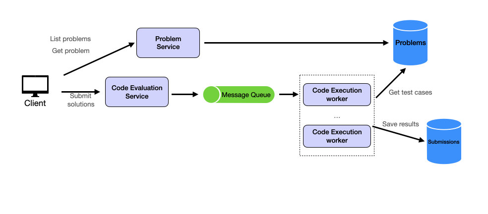

# Yeetcode - An unserious code judge
---

> [!IMPORTANT]
> Open to contributions but please do not pollute this project with AI generated code for business logic. :`)

A playful coding platform for unserious programmers.
A question bank with thousands of programming questions; users can write, compile and submit code against test cases and get results. User submitted code needs to be persisted.

### Core Requirements

1. View Problems: Users should be able to view problem descriptions, examples, constraints, and browse a list of problems.
2. Submit Solution: Users should be able to solve coding questions by submitting their solution code and running it against built-in test cases to get results.

### User flow & HLD

When a `user` submits a `solution`, the `Code Evaluation Service` pushes a message containing the submission details (user ID, problem ID, and code) to the `Message Queue`. This decouples the submission process from the execution process, allowing us to handle traffic spikes more effectively.

On the other side of the Message Queue, we have multiple `Code Execution Workers`. These workers continuously poll the queue for new submissions. When they receive a message, they fetch the necessary test cases from the `Problems database`, execute the code in a sandboxed environment, and record the results in the `Submissions database`.

### Folder Structure(hopefully)

    yeetcode/
    │
    ├── client/                     # Next.js frontend
    │   └── src/
    │       ├── app/
    │       ├── components/
    │       └── lib/
    ├── services/
    │   ├── problem-service/       # Express app for problem CRUD
    │   └── evaluation-service/    # Submissions, queue integration
    │
    ├── workers/
    │   └── code-executor/         # Polls queue, runs submissions
    │       ├── docker/
    │       └── runner.js
    │
    ├── database/
    │   ├── migrations/
    │   └── seed/
    │
    ├── docker-compose.yml
    ├── .env
    └── README.md

### Future Scope:

- Weekly Contests
- Realtime leaderboards
- Discussions
- Premium features: AI assissted feedback and more
